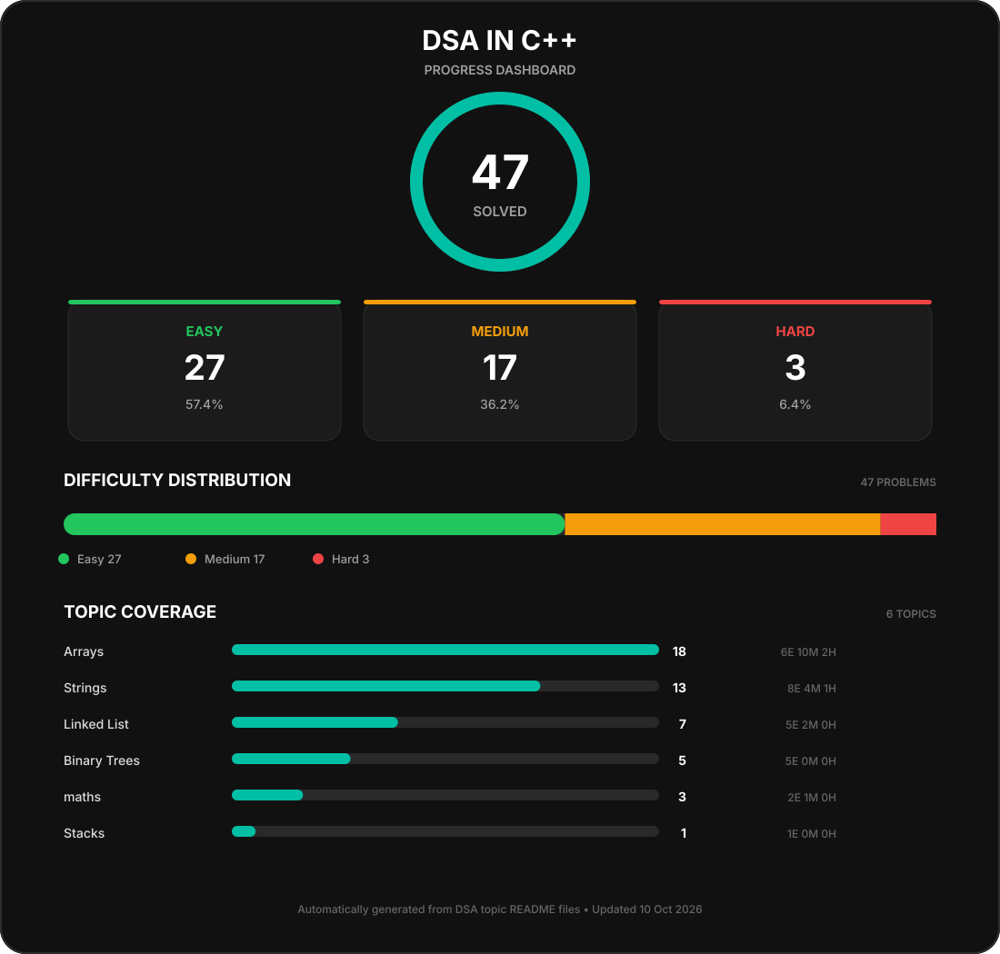

\# 🧠 DSA in C++

My DSA practice repository in C++ covering core data structures,

algorithms, and LeetCode problems.

\## 📊 Progress Dashboard

&#x20; 

\## 📚 Topics

| Topic | Problems |

|---|---:|

| \[Arrays](./Arrays/) | 13 |

| \[Strings](./Strings/) | 11 |

| \[Linked List](./Linked%20List/) | 7 |

| \[Binary Trees](./Binary%20Trees/) | 5 |

| \[Maths](./maths/) | 3 |

| \[Stacks](./Stacks/) | 1 |

\## 🎯 Repository Goal

This repository tracks my DSA journey in C++ with a focus on:

\- Problem-solving

\- Pattern recognition

\- Time and space complexity

\- Data structures

\- Algorithms

\- Consistent LeetCode practice

Each topic contains my C++ solutions along with a README

containing the problems and their difficulty levels.

\---

> The dashboard is automatically generated from the README files

> inside each DSA topic.

